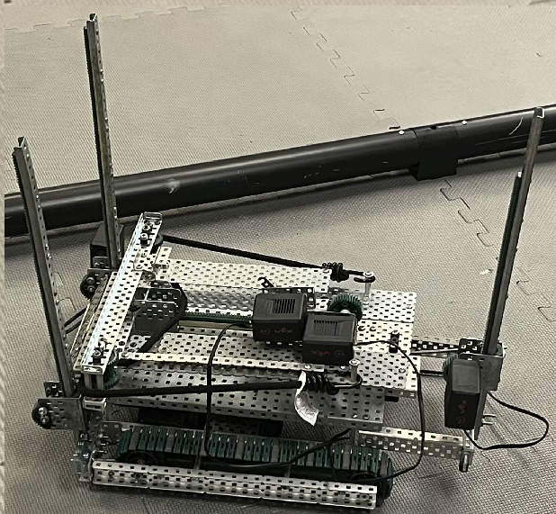

# Remote-Operated Disk Launcher

## Team Members
- **Austin Neubauer**
- **James Wiley**
- **Alex Stockton**

## Roles
- **Austin** — Lead Builder, Designer
- **James** — Lead Designer, Builder, Programmer
- **Alex** — Documentation, Programmer

---

## Objectives

### Minimum Requirements
Our primary objective was to design and control a **remote-operated disk launcher robot**. The robot was controlled via a remote with a button to manually launch each loaded disk.

At a minimum, the robot is able to:
- [x] Hold **at least one** disk in ammunition slot
- [x] **Move** based on user input from a remote control
- [x] **Turn** left or right in place (pivoting without linear movement)
- [x] **Adjust the pitch angle** of the disk launcher (increase/decrease)
- [x] **Launch a disk**

### Ideal Goals
Our ultimate goal was to design an **autonomous disk-launching robot**.

This robot could have been able to:
- [ ] **Automatically collect ammunition**
- [ ] **Chamber ammunition** in preparation for launch
- [ ] **Locate a persistent target** from any position on the field
- [ ] **Calculate a launch trajectory**, including both horizontal and vertical angles
- [ ] **Launch the disk** a set time after target acquisition

---

## Images

*Brain atop a base. When the brain receives controller input, motors on the droid's underside control the tank treads, pulling the droid along and ensuring all wheels spin in tandem.*

*Primitive launch setup; The disk sits on a track. A rubber band, seated on two wheels, holds the disk in place. A gear (on the bottom) pulls the rubber band back along the track. Originally, a pin was going to lock the gears in place. This was later changed to a hook and screw.*

*The launcher has three supports that red motors ride on to control the pitch of the crossbow. These supports let it stand upside down for ease of design.*

*Launcher has three layers of mechanisms. Bottom layer contains a hanging brain and battery that controls everything else. Wheels also lie here. Second layer contains the motors and tracks that control the pitch of the crossbow. Top layer contains the ammunition slot and crossbow mechanisms.*

*The launcher sitting idle; The crossbow contains two motors attached to a slot and a hook. The pullback gear rotates forward and back to control the launching power. It hook rotates forward to grab a screw. Then it pulls back, allowing the user to load a disk into the ammunition slot. The hook rotates back, and the bungee cord automatically launches the disk forward and out of the crossbow.*

*The crossbow rests on a rear axle that lets it slide back and forth while its launch angle is adjusted. This prevents the supports being pulled together since diagonals take up less horizontal space. Adjusting the pitch of the crossbow automatically slides it on the axle.*

---

## Videos

Last updated: `12/9/2025`
